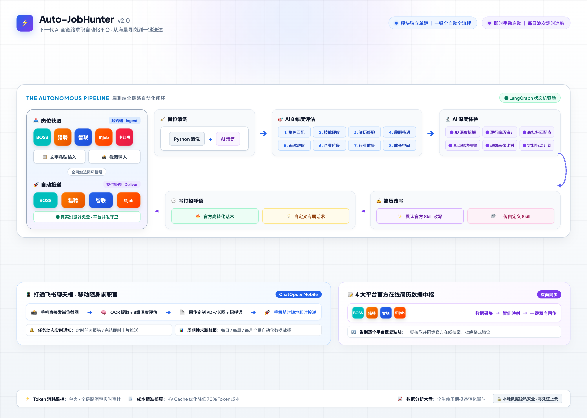

# JobHunter — AI 全链路求职自动化平台

[](https://github.com/jolie-z/jobhunter-ai/actions/workflows/tests.yml)

> 从岗位抓取 → 数据清洗 → AI 评估 → 简历改写 → 人工审批 → 自动投递的端到端求职自动化系统，支持飞书 ChatOps 指挥与多维表格数据同步。
> 🧬 本项目是 [Auto-JobHunter](https://github.com/jolie-z/Auto-JobHunter)（⭐ 80+）的全面升级版：招聘平台从 3 家扩到 4 家，新增四分屏定制工作台、在线简历多平台回写、面试训练营与飞书 ChatAgent，全链路代码重构。



## ✨ 核心能力

| 模块 | 说明 |
|------|------|
| 🕷️ 多平台爬虫 | BOSS 直聘、前程无忧（51job）、猎聘、智联招聘四大平台岗位抓取，基于 Playwright + 持久化浏览器 Profile 保持登录态 |
| 🧹 数据清洗引擎 | Tier1 硬规则过滤 + Tier2 AI 初筛打分，全链路模块复用的统一核心组件 |
| 🧠 AI 评估与改写 | LangGraph 状态机驱动的评估→改写/快速话术→审批→投递流水线，支持 A/B 级深度改写与 C-F 级海投话术 |
| 🚀 自动投递 | 简历改写后精准投递 + 海投简历批量投递（mass_apply），平台级并发守卫防反爬 |
| 💬 飞书 ChatOps | 在飞书聊天框用自然语言下达指令（抓取/清洗/评估/推送/查库），LLM 意图解析 + SSE 实时日志流 |
| 🤖 飞书 ChatAgent | 对话式求职助理：持久会话记忆（跨重启续接）、交互卡片、公司情报（表格缓存 + Tavily 实时搜索）、简历微调闭环；红线：绝不自动/批量投递。实验性功能，计划 v1.0 正式发布 |
| 📊 飞书多维表格 | 岗位线索、简历库、求职偏好、面试报告等多维表格双向同步（带防重复查重） |
| 📝 简历编辑器 | V2 可视化简历编辑 + 四平台在线简历回写（BOSS/猎聘/51job/智联）与映射报告 |
| 🎤 面试训练营 | 模拟面试（WebSocket + TTS）、面经粉碎、公司背调（Tavily 搜索） |

## 🧪 平台支持状态

| 平台 | 岗位抓取 | 自动投递 | 简历回写 | 状态 |
|------|:---:|:---:|:---:|------|
| BOSS 直聘 | ✅ | ✅ | ✅ | 核心平台，持续真机验证 |
| 前程无忧 51job | ✅ | ✅ | ✅ | 核心平台，持续真机验证 |
| 猎聘 | ✅ | ✅ | ✅ | 核心平台，持续真机验证 |
| 智联招聘 | ✅ | ✅ | ✅ | 核心平台，持续真机验证 |

> 招聘平台页面改版与风控升级可能造成功能间歇性失效，适配更新随版本发布；遇到问题欢迎提 issue。

## 🏗️ 技术栈

- **后端**：FastAPI · LangGraph · DrissionPage + Playwright（CDP）· SQLite（岗位主库）· APScheduler · Python 3.10+（uv 管理）
- **前端**：Next.js (App Router) · Tailwind CSS v4 · shadcn/ui · Zustand · Vitest · ESLint
- **集成**：飞书开放平台（多维表格 + 机器人 + ChatOps）· LLM（OpenAI 兼容接口）· Tavily 搜索 · Sentry
- **部署**：宿主机常驻（uvicorn + Next.js；爬虫依赖真实浏览器环境，不可容器化）

## 📁 项目结构

```
jobhunter-ai/
├── backend/                  # FastAPI 后端
│   ├── app/                  # 核心应用（API 路由、自动化流水线、ChatOps、设置）
│   │   ├── automation/       # LangGraph 流水线 + 调度器 + 平台守卫
│   │   ├── api/routes/       # chatops / webhook / crawlers 等路由
│   │   └── core/             # 配置、LLM 客户端、飞书客户端、PDF 渲染
│   ├── boss_scraper/         # BOSS 直聘爬虫
│   ├── 51job_scraper/        # 前程无忧爬虫 + 海投
│   ├── liepin_scraper/       # 猎聘爬虫
│   ├── zhilian_scraper/      # 智联招聘爬虫
│   ├── job_processor/        # 清洗流水线（step1 规则过滤 / step2 飞书同步）
│   ├── ai_agents/            # AI 评估、改写、打招呼语生成
│   ├── resume_editor/        # 四平台简历回写引擎
│   └── data/                 # 浏览器 Profile（登录态）与 SQLite 数据库
├── frontend/                 # Next.js 前端（简历编辑器、流水线看板、策略实验室、全链路指挥中心）
├── scripts/                  # 运维脚本（配置验证、GitHub 流量归档）
└── docs/                     # 长期文档（含已弃用的 docker-archive）
```

## 🚀 快速开始

### 环境要求

- Python 3.10+（推荐 [uv](https://docs.astral.sh/uv/)）
- Node.js 18+
- **Microsoft Edge 浏览器（必需）**：四大平台的岗位抓取与自动投递均通过 CDP 接管真实 Edge（持久化 Profile + 登录态）；未安装 Edge 时，岗位抓取与自动投递无法运行

### 第 0 步：飞书准备（先拿凭证，再谈启动）

系统用飞书多维表格作为岗位 / 简历 / 面经的数据中枢。接入 = 拿齐 **5 个值**（App ID / App Secret / App Token / 各表 Table ID / 群或个人 ID）+ 做对 **3 处授权**。按顺序：

1. 复制模板：打开 [多维表格模板链接](https://ucncdzmaddi9.feishu.cn/base/VfEwbBBNhaqzEBsK18oc665Qnkh) →「...」→「**保存副本**」到你的云空间（5 张数据表 + 57 字段岗位汇总表 + 视图配置，免手建）
2. 创建应用：[open.feishu.cn](https://open.feishu.cn) → 开发者后台 → 创建企业自建应用 →「凭证与基础信息」复制 **App ID**（`cli_` 开头）与 **App Secret**
3. 文档授权：副本「分享」→ 把应用加为**可编辑协作者**（不加的话应用拿着 Token 也读不了表）
4. 开权限并发布：应用开通**机器人**能力 + `im:message` / `im:chat` / `bitable` 读写权限 → **创建版本并发布**（飞书的权限变更不发布版本就完全不生效）
5. 拿表格地址：副本浏览器地址栏里，`/base/` 后是 **App Token**，`table=` 后是各表 **Table ID**（每张表各一个）
6. 配置事件订阅：应用「事件与回调 → 事件配置」切到「**使用长连接接收事件**」，添加 `im.message.receive_v1` 事件（不做这步机器人收不到群消息，改完建议再发一个版本）

以上值全部填进「策略实验室 → 系统底层配置 → 飞书」分组即可（每个字段对应哪张表、预警接收人 / 审批白名单的 `ou_` / `oc_` ID 去哪拿，见 [docs/feishu-setup.md](docs/feishu-setup.md) 的**配置项字典**；事件订阅、拉群、一键「检测连通性」与排错 FAQ 也在同一手册）。

### 本地启动

```bash
# 1. 后端
cd backend
uv sync                              # 安装依赖
cp .env.example .env                 # 按需填写密钥（飞书/LLM 等）
playwright install chromium          # 首次需安装浏览器
uvicorn app.main:app --reload        # 启动 http://localhost:8000

# 2. 前端
cd frontend
npm install
npm run dev                          # 启动 http://localhost:3000
```

> Windows 用户可直接双击 `start_all.bat` 一键拉起前后端。

### 新机自检（点「启动全链路」之前，先跑这条命令）

服务能起来 ≠ 链路能跑：飞书凭证、清洗策略、评估权重、简历、平台 Cookie 文件
**都在 git 仓库之外**，全新克隆后必须补齐，否则指挥中心的启动按钮会被配置门禁
拦下（或跑起来后整轮 0 条空转）。一条命令体检：

```bash
cd backend && uv run python scripts/newmachine_check.py   # 或 .venv/bin/python scripts/newmachine_check.py
```

- 每个缺失项都会就地打印「怎么补」；`exit 0` = 抓取资产齐备，可以去指挥中心点启动。
- 按钮若显示「待配置规则 (N)」：点它弹出 toast 并打开第一个未完成的配置面板，逐项补齐即可。
- 投递就绪段仅提示：平台 CDP 端口未监听属正常（尚未唤起浏览器），投递前在指挥中心
  「平台会话」唤起并扫码即可；投递登录态以投递引擎登录门实测为准。

配置模板：`cp backend/data/settings.json.example backend/data/settings.json`
（纯 JSON 不可写注释，逐字段说明见下方配置说明表格与 [docs/feishu-setup.md](docs/feishu-setup.md)
配置项字典；也可以不复制，直接在前端「策略实验室 → 系统底层配置」页面填写，写入的就是同一文件）。

猎聘说明：猎聘搜索预检免 DOM 登录校验，但抓取引擎依赖本地
`backend/liepin_scraper/liepin_cookies.json`（缺失时预检会拦截并等你扫码）——
新机请先在 backend 终端跑 `liepin_scraper/liepin_cookie_harvester.py` 扫码生成，
步骤见 [docs/liepin-setup.md](docs/liepin-setup.md)。

### 生产部署（宿主机常驻）

> ⚠️ 本项目**不支持 Docker 部署**：四大平台爬虫依赖真实 Edge 浏览器 + 持久化登录态 +
> 人工扫码/滑块介入，容器内 headless 浏览器指纹会触发平台风控（历史编排归档见
> `docs/docker-archive/`）。

```bash
# 后端（生产模式，去掉 --reload）
cd backend && uvicorn app.main:app --host 0.0.0.0 --port 8000

# 前端（构建后启动）
cd frontend && npm run build && npm start
```

建议用 [pm2](https://pm2.keymetrics.io/) / launchd / supervisor 守护进程常驻，示例：

```bash
pm2 start "uvicorn app.main:app --host 0.0.0.0 --port 8000" --name jobhunter-api --cwd backend
pm2 start "npm start" --name jobhunter-web --cwd frontend
```

## ⚙️ 配置说明

后端采用 **pydantic-settings + `.env` + `settings.json` 双层配置**：`.env` 提供启动期默认值，运行时可在「策略实验室 → 系统底层配置」页面热更新（写入 `settings.json`，优先级更高）。页面保存后绝大多数配置**即时生效**（飞书长连接自动用新凭证重连、ChatAgent 自动重建），无需重启。

> 📚 **新手第一次接入飞书？请按 [docs/feishu-setup.md](docs/feishu-setup.md) 完整手册一步步来**（创建应用 → 权限 → 长连接 → 拉群 → 一键「检测连通性」→ ping 通），附排错 FAQ。

关键配置项：

| 分组 | 配置项 | 用途 |
|------|--------|------|
| LLM | `OPENAI_API_KEY` / `OPENAI_BASE_URL` / `OPENAI_MODEL` | 评估、改写、飞书聊天 Agent |
| LLM | `VISION_MODEL` / `VISION_API_KEY` / `VISION_BASE_URL` | 视觉模型（独立通道可选，默认复用主通道） |
| LLM | `CLEANER_LLM_*` + `USE_MAIN_LLM_FOR_CLEANER` | 清洗专属通道（未配置自动回落主通道） |
| 飞书 | `FEISHU_APP_ID` / `FEISHU_APP_SECRET` / `FEISHU_APP_TOKEN` + 各表 `FEISHU_TABLE_ID_*` | 多维表格同步与聊天指令 |
| 搜索 | `SERPER_API_KEY` / `TAVILY_API_KEY` | 公司情报（Serper 主 / Tavily 备） |
| 语音 | `VOLC_ASR_APPID` / `VOLC_ASR_TOKEN` | 面试语音转文字（保存后需重启） |
| 地图 | `AMAP_API_KEY` | 岗位地址导航直达 |

运行 `python scripts/test_config_validation.py` 可一键验证所有密钥是否生效。

## 🧪 测试

```bash
# 前端单元测试
cd frontend && npm test

# 后端测试
cd backend && pytest tests/

# ChatOps 指令批量验证（13 用例）
python backend/test_scripts/test_feishu_chatops.py --batch

# 底层配置验证（飞书/LLM/搜索/数据库）
python scripts/test_config_validation.py all
```

## ⚠️ 免责声明

本项目仅供学习与技术交流，使用本项目即表示你理解并同意：

- 各招聘平台的用户协议通常禁止自动化抓取与自动投递，使用本项目产生的**账号风控、封禁等一切后果由使用者自行承担**；
- 请合理控制请求频率，尊重平台与招聘方，勿将本项目用于垃圾信息投递；
- 本项目不收集、不上传任何用户数据：浏览器登录态、数据库与密钥均仅保存在使用者本地；
- 本项目按 GPL-3.0 提供，**不附带任何形式的担保**，作者不对使用者的使用行为承担责任。

## 📄 License

本项目基于 [GPL-3.0](./LICENSE) 协议开源。随附的第三方资产按其各自协议提供（如 [Noto Sans SC](https://fonts.google.com/noto) 字体，SIL Open Font License）。

## 🙏 参考项目

本项目参考了以下项目，感谢原作者的分享：

- [wanyichen06/LLMInternSkill](https://github.com/wanyichen06/LLMInternSkill)
- [lan1177/interview-prep](https://github.com/lan1177/interview-prep)
- [santifer/career-ops](https://github.com/santifer/career-ops)
