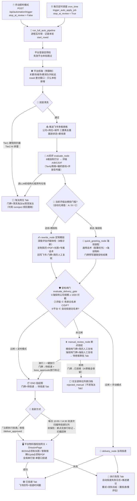
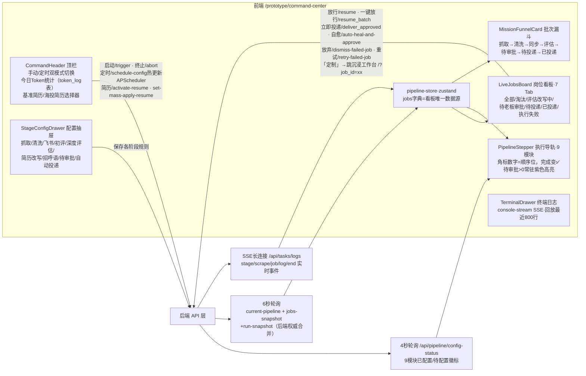
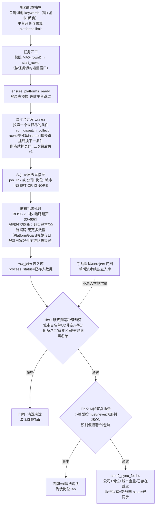
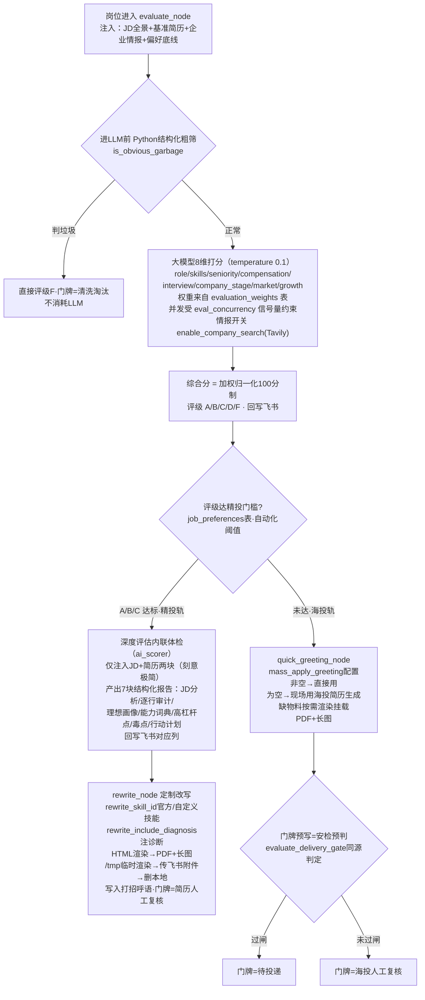
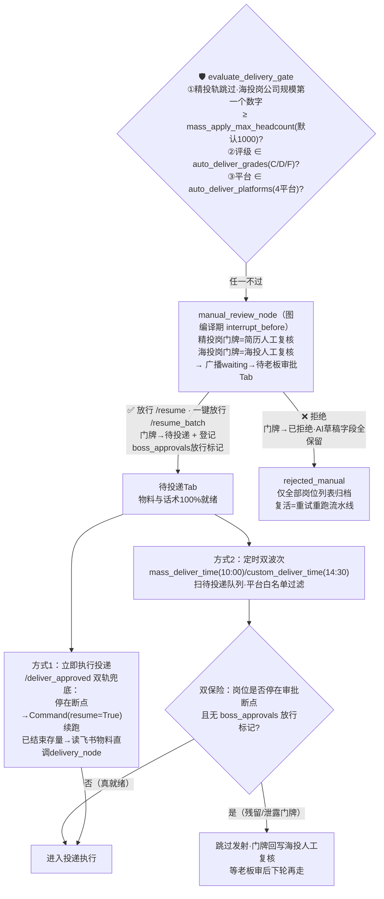
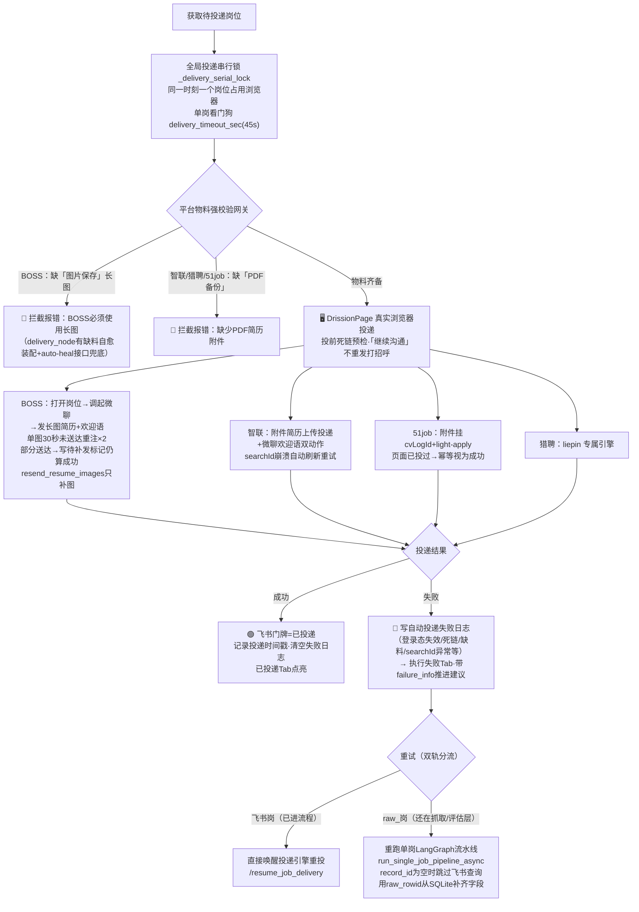

# 全链路指挥中心 · 真实链路图

> **口径说明**：本文全部基于底层真实代码绘制（截至 2026-08-28，含门牌跟随安检、波次双保险、「已拒绝」归档、E 级清理等全部已合入修复）。
> 与早期设计流程图的区别：本文画的是**系统实际怎么跑**，不是设计意图。
>
> **图例**：🟪启动入口 ｜ 🔵处理环节 ｜ 🔶判定分流 ｜ 🟢成功终态 ｜ 🔴失败/拦截终态 ｜ ⬜看板/归档

---

## 一、总图：一个岗位的一生

---

## 二、子图 A：指挥中心前端结构与数据流

**Tab 判定速查**（前端内存谓词过滤，计数=命中数）：

| Tab | 命中条件（status / node / 门牌） |
|---|---|
| 全部岗位 | 不过滤（rejected_manual 也只在这里出现） |
| 淘汰岗位 | 清洗淘汰 / ai清洗淘汰 / node=clean_rejected / rejected_auto（E/F 初评自动淘汰，node=clean_rule_rejected） |
| 评估/改写/投递中 | 其余 status=running（包含 AI 初评、深度评估、定向改写与自动投递执行中） |
| 待审批 | waiting / node=manual_review_node（门牌=简历人工复核·海投人工复核·待审批） |
| 待投递 | approved / ready_to_deliver / 门牌=待投递 |
| 已投递 | delivered / 门牌=已投递 |
| 执行失败 | error 或带 failure_info 且未复活 |

---

## 三、子图 B：数据摄取与清洗层

---

## 四、子图 C：AI 初评与双轨物料

---

## 五、子图 D：安检、审批与状态机

**门牌 ↔ 看板 归属总表**（谁写入 → 落在哪个 Tab）：

| 跟进门牌 | 写入者 | 看板归属 |
|---|---|---|
| 新线索 | step2 飞书推送 | 全部岗位（评估中） |
| 清洗淘汰 / ai清洗淘汰 | Tier1 / Tier2 / 结构化粗筛 | **淘汰岗位** |
| 已完成初步评估 | 初评低分轨占位 | 全部岗位（done 卡） |
| 简历人工复核 | 精投轨评估完成 / manual_review_node | **待老板审批** |
| 海投人工复核 | manual_review_node / 门牌预写未过闸 / 波次纠错 | **待老板审批** |
| 待投递 | 过闸预写 / 放行动作 | **待投递** |
| 已投递 | 投递引擎成功回写 | **已投递** |
| 已拒绝 | 老板拒绝动作（新） | 仅全部岗位（rejected_manual） |
| 已下架 | BOSS 死链预检剔除 | 全部岗位 |
| 已放弃（SQLite） | 看板「放弃」dismiss | 移出指挥中心 |

---

## 六、子图 E：发射与投递执行

---

## 七、已知的“形态差异”备忘（非缺陷，判定不改）

1. **增量窗口**：按任务起点 `MAX(rowid)` 切，非设计图的“T+3 时间窗”——效果等价（爬虫只在任务内跑，本轮号段=本轮新岗）；
2. **深度评估**：内联在 evaluate_node 高分轨，非独立节点；`deep_eval_node` 仅是广播别名叫得上号，指挥中心进度显示正常；
3. **平台保安**：PlatformGuard 冷却/日限额与 PlatformSemaphore 已写好但主链路未接线，实际靠随机 sleep + 各爬虫局部熔断；出现风控迹象时再移植；
4. **审批唤醒**：approve 只盖飞书门牌，图解冻延后到投递按钮/波次的 `Command(resume=True)`（裸命令，物料已在档案）——即四格规格的两段式。
